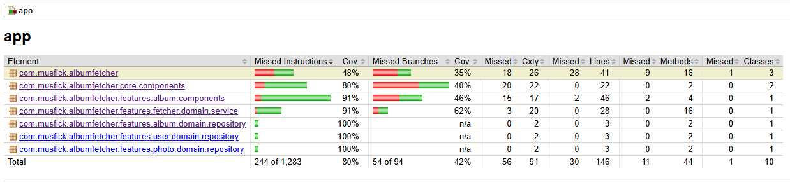

<h1 align="center">AlbumFetcher</h1>

  
An Android app consuming a https://jsonplaceholder.typicode.com API to display album list. it has been built with Kotlin, Jetpack Compose, Repository Pattern and MVVM pattern as well as Architecture Components. Also uses unitTest and instrumentation testing 

 
Here's a video of how it looks.

## 📱 Tech stack & Open-source libraries
- Jetpack Compose (Android UI)
- Retrofit (REST client)
- OkHttp (HTTP client)
- Gson (JSON parsing)
- Coil (Kotlin-first image loading)
- Coroutines & Flow
- Background Services
- Hilt (Dependency Injection)
- Logcat (Logging)
- Chucker (Monitor HTTP Request)
  
 

## 🧪 Testing libraries
- JUnit (Unit testing)
- Compose UI Testing
- Turbine (Flow testing)
- Mockwebserver (Fake Api Service)
- Test Covered (Compose Screen <- ViewModel <- Service <- Repository)

 

## 🛠️ Development Tools
- Android Studio Ladybug | 2024.2.1 Patch 3

 

## 📈 Code coverage
- JaCoCo (an open-source toolkit for measuring and reporting Java code coverage)

 

## 📈 Run Test
Before running test coverage please comment out ``@AndroidEntryPoint``
in AlbumFetcherService class. The reason is that No JaCoCo test coverage on @AndroidEntryPoint classes
Open Issue[https://github.com/google/dagger/issues/1982]

after comment ``@AndroidEntryPoint`` out in AlbumFetcherService class than run this command
 
``./gradlew JacocoDebugCodeCoverage``
